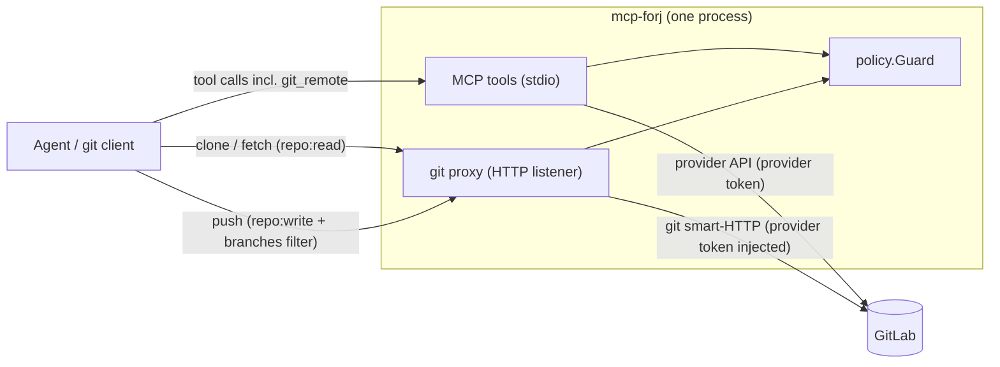

# mcp-forj

A policy-governed [Model Context Protocol](https://modelcontextprotocol.io) server that gives AI agents
controlled access to code hosting providers. The first iteration supports **GitLab** (multiple instances);
GitHub and the internal "Forgejo" system are planned and already accounted for by the provider abstraction.

Access is **deny-by-default** and configured per provider and repository. Repositories containing a `.noai`
marker file deny **every** capability unless the matching grant is explicitly exempted with
`noai: allow` (see [`.noai` marker](#noai-marker)).

See [`AGENTS.md`](AGENTS.md) for contributor/agent instructions and
[`configs/config.example.yaml`](configs/config.example.yaml) for a documented configuration.
Architecture decisions, bug analyses and per-tool specs live under [`ai/`](ai/README.md).

## Status

Early first draft. The API and configuration format may still change.

## Requirements

- Go 1.27+
- A GitLab token with the required permissions (see [GitLab token permissions](#gitlab-token-permissions))

## Build

```bash
make build        # -> bin/mcp-forj
make test         # run the test suite
make cover        # coverage report
```

## Run

```bash
cp configs/config.example.yaml configs/config.yaml
export GITLAB_WORK_TOKEN="<your-token>"
./bin/mcp-forj -config configs/config.yaml
```

The server speaks MCP over stdio; all logging goes to stderr. `-config` defaults to `configs/config.yaml`,
and the `MCP_FORJ_CONFIG` environment variable overrides that default path.

### Use with opencode

Register the server as a local MCP server in `opencode.json` (absolute paths are recommended):

```json
{
  "mcp": {
    "mcp-forj": {
      "type": "local",
      "command": ["/path/to/bin/mcp-forj", "-config", "/path/to/configs/config.yaml"],
      "enabled": true,
      "environment": { "GITLAB_WORK_TOKEN": "{env:GITLAB_WORK_TOKEN}" }
    }
  }
}
```

opencode loads its configuration once at startup, so restart it after editing.

## Tools

| Tool                       | Capability    | Description                                     |
|----------------------------|---------------|-------------------------------------------------|
| `list_configured_rules`    | `policy:read` | List configured rules and capabilities.         |
| `list_repositories`        | see below     | List configured repositories, plus discovered.  |
| `list_merge_requests`      | `mr:read`     | List merge requests (metadata only, no diffs).  |
| `get_merge_request`        | `mr:read`     | Fetch one merge request.                        |
| `list_merge_request_notes` | `mr:read`¹    | List comments on a merge request.               |
| `get_merge_request_diff`   | `mr:diff`     | Fetch the file diffs of a merge request.        |
| `add_merge_request_note`   | `mr:comment`¹ | Comment on a merge request.                     |
| `rebase_merge_request`     | `mr:rebase`   | Trigger an asynchronous merge request rebase.   |
| `merge_merge_request`      | `mr:merge`    | Merge a merge request (returns the merged MR).  |
| `read_file`                | `repo:read`   | Read a repository file at an optional ref.      |
| `git_remote`               | `repo:read`   | Return the git proxy clone URL (token never returned). |

¹ The GitLab **notes** endpoints are additionally governed by the **Work Item** permission; see
[GitLab token permissions](#gitlab-token-permissions).

`git_remote` is registered only while `server.git_proxy` is enabled — see [Git proxy](#git-proxy).

## Git proxy

Besides the MCP tools, the server can embed a **git smart-HTTP reverse proxy**: a second, HTTP
entry point in the same process that serves real `git clone`/`fetch`/`push` through the **same**
`policy.Guard` — same rules, capabilities and `.noai` overlay; the proxy holds no allowlist of its
own.



**Usage.** Enable the proxy in the config; the agent learns the URL from the `git_remote` tool
(repo:read-gated, the URL is credential-free and the token is never returned by any tool):

```yaml
server:
  git_proxy:
    enabled: true
    listen: 127.0.0.1:8417
    public_url: http://127.0.0.1:8417
    # token: "${GIT_PROXY_TOKEN}"   # optional; selects the auth mode
```

- **Fetch/clone** requires `repo:read`, **push** requires `repo:write` with a `branches` filter
  (doublestar on the target branch; without one **no push** is allowed, fail-closed). The proxy
  additionally never pushes the default branch, never deletes branches and accepts only
  fast-forwards.
- **Client auth** is HTTP Basic with the optional `git_proxy.token` as password (username
  ignored). Without a token the proxy binds **loopback only** and authenticates nobody;
  `git_remote` then reports `auth.type: "none"`. The token is never logged and never returned by
  any tool.
- **Provider auth** stays separate: the proxy strips every inbound credential header and injects
  the provider's own git credential, so client and provider identities never mix and only the
  server's token ever reaches GitLab.

**Limits** (all fail-closed by design; see [ADR 0011](ai/adr/0011-git-smart-http-reverse-proxy.md)
and [`ai/architecture.md`](ai/architecture.md)):

- An active `paths` filter cannot be enforced over git (a fetch is whole-tree), so a
  path-filtered `repo:read`/`repo:write` grant gets **no git access** at all.
- Git traffic carries no tags and the proxy keeps no cache, so **tag-constrained grants** always
  deny over git.
- `.noai` on a **fetch** can only be checked on the **default branch**; a **push** checks the
  default branch and the target branch.
- No Git LFS: the LFS endpoints are not served (404).

## Capabilities

- `policy:read` – expose the configured rules for a provider (`list_configured_rules`).
- `repo:list` – discover repositories through the provider API.
- `repo:read` – read repository files; also gates **git fetch/clone** through the git proxy.
- `mr:read` – view merge request metadata and notes (no diffs).
- `mr:diff` – read merge request file diffs (`get_merge_request_diff`).
- `mr:comment` – comment on merge requests.
- `mr:rebase` – trigger an asynchronous merge request rebase.
- `mr:merge` – merge a merge request.
- `mr:write` – reserved (create/update/close merge requests).
- `repo:write` – gates **git push** through the git proxy. The `branches` filter of the grant
  (doublestar on the target branch, exclude wins) decides which branches may be pushed; without
  one **no push** is allowed. The only capability that accepts a `branches` filter.

## Configuration

Rules are evaluated in order and the **first match wins**; put specific rules before broad ones. A rule
with `effect: allow` grants only the capabilities it lists (everything else is denied); a rule with
`effect: deny` denies the matched repositories entirely and must not list `capabilities`. If no rule
matches, access is denied.

```yaml
providers:
  - name: gitlab-work
    type: gitlab
    base_url: https://gitlab.example.com
    token: "${GITLAB_WORK_TOKEN}"   # literal or ${NAME} env reference
    project_scope: accessible       # accessible (default) | membership
    rules:
      - repositories: ["devops/components/*", "devops/tooling/*"]
        effect: allow
        capabilities:
          - mr:read
          - mr:rebase
          - mr:diff:
              require: [renovate]
          - repo:list
          - repo:read:
              paths:
                include: ["pom.xml", "go.mod", "package.json", "Dockerfile"]
      - repositories: ["legacy/**"]
        effect: deny
```

### Capability filters

Any capability may carry a filter, written as a single-key mapping in the `capabilities` list. For merge
request capabilities the tags are GitLab MR **labels**; for repository capabilities they are project
**topics**. `repo:read` and `repo:write` may additionally restrict **file paths** with doublestar globs:

```yaml
capabilities:
  - mr:read
  - mr:comment:
      require: [ai-reviewed]        # MR must have ALL of these labels
      exclude: [do-not-touch]       # MR must have NONE of these labels
  - repo:list:
      require: [ai-ok]              # project must have this topic
  - repo:read:
      exclude: [confidential]       # project must not have this topic
      paths:
        include: ["docs/**", "*.md"]           # path must match at least one
        exclude: ["**/.env", "**/secrets/**"]  # path must match none
```

Tags are matched by exact, case-sensitive equality. Path globs are case-sensitive (`*.md` is root-level
only, `**/*.md` matches at any depth). An empty `paths.include` allows all paths; `paths.exclude` wins
over `paths.include`; an active path filter with an empty path fails closed. Tags and paths combine (both
must pass). Whenever required information cannot be determined, the decision fails closed. A capability
may also carry `noai: allow` to exempt it from the `.noai` default-deny overlay.

### Repository listing

`list_repositories` returns concrete repositories listed **literally** in the configuration without any
capability or provider call, unless a `deny` rule hides them. The `repo:list` capability additionally
enables discovery of repositories matching glob patterns through the provider API.

- Discovery derives search prefixes from the `repo:list` patterns (for example `devops/platform/**` →
  `devops/platform`). Each prefix is tried **group-first** with
  `GET /groups/:id/projects?include_subgroups=true` (which works for group-scoped fine-grained tokens),
  falling back to the `/projects` search with `search_namespaces=true` when the term is not a group. An
  explicit `search` argument is passed through verbatim.
- `project_scope` controls breadth: `accessible` (default, all projects the token can see) or `membership`.
- The `limit` argument bounds only discovered repositories (default 100, capped at 1000); literal
  repositories are always returned. Results are deduplicated and sorted and report `truncated`;
  repositories hidden by policy are not counted in the output.
- Listing never checks the `.noai` marker, so a `.noai` repository may appear. An active `repo:list` topic
  filter also applies to literal config repositories (their topics are fetched, fail-closed).

### `.noai` marker

`.noai` is a **capability-level default-deny overlay**: on a repository carrying the marker, every
capability is denied unless the matching grant is explicitly exempted with `noai: allow`. The marker is
checked on the repository's default branch (and, when `read_file` reads a non-default `ref`, also at that
ref) and is **fail-closed** (a check failure denies). It is evaluated after the policy decision (first
match wins); an exempt grant skips the check.

```yaml
capabilities:
  - repo:list              # not exempt -> .noai repos are hidden from discovery
  - repo:read:
      noai: allow
  - mr:read:
      noai: allow
  - mr:rebase              # not exempt -> denied on .noai repos
  - mr:merge               # not exempt -> denied on .noai repos
```

Literal (explicitly configured) repositories are always listed, even if `.noai`. Discovered `.noai`
repositories are omitted unless the `repo:list` grant is exempt. `.noai` is an **integrity control**
(no unreviewed changes), not a confidentiality control: content can still reach the agent through
exempted reads (`repo:read`, `mr:read`, `mr:diff`).

Because the marker is checked for every non-exempt capability, the token must be able to read repository
files on the default branch; otherwise non-exempt operations on **any** repository fail closed. A
`.noai` denial is reported to the client indistinguishably from an unknown repository, so the marker and
the repository's existence are not disclosed.

## GitLab token permissions

The token is read from the config `token` value (a literal or `${NAME}`). The resolved secret is never
logged or returned. The config is git-ignored, so a real config with a literal token is not committed.

Fine-grained personal access tokens (GitLab 18.10+, GA 19.2): add the target **groups/projects** under
"Group and project access", then grant the permissions for the operations you enable:

| Capability / tool                    | Fine-grained permission                                                       |
|--------------------------------------|-------------------------------------------------------------------------------|
| `list_repositories` (`repo:list`)    | **Project: Read**                                                             |
| `read_file` (`repo:read`, `.noai`)   | **Repository: Read**                                                          |
| `mr:read` (list/get)                 | **Merge Request: Read**                                                       |
| `get_merge_request_diff` (`mr:diff`) | **Merge Request: Read**                                                       |
| `rebase_merge_request` (`mr:rebase`) | **Merge Request: Update** (+ Merge Request: Read; push to source)             |
| `merge_merge_request` (`mr:merge`)   | **Merge Request: Update** (+ Merge Request: Read; merge role, e.g. Developer) |
| `list_merge_request_notes`           | **Work Item: Read** (+ Merge Request: Read)                                   |
| `add_merge_request_note`             | **Work Item: Create** (+ Merge Request: Read)                                 |
| git fetch/clone via proxy (`repo:read`) | **Repository: Read**                                                       |
| git push via proxy (`repo:write`)    | **Repository: Write**                                                         |
| `mr:write` (reserved)                | Merge Request: Create/Update/Close                                            |

Every **non-exempt** operation also reads the `.noai` marker file, so **Repository: Read** (on the
default branch) is required regardless of the granted capabilities; otherwise those operations fail
closed.

Classic tokens: use the `api` scope (read+write) or `read_api` (read only). A rebase also needs at least
the **Developer** role (push access to the source branch); merging also needs a role allowed to merge
(typically **Developer**). The repository-files endpoint requires a `ref`; the server sends `HEAD`
(default branch) when no ref is given.

## Limitations

- `list_merge_requests` enforces an active `mr:read` filter client-side from the labels returned by the
  list endpoint; non-matching or unknown-label merge requests are omitted (the count is logged
  server-side only and not returned).
- `rebase_merge_request` triggers an **asynchronous** rebase. The outcome appears later via
  `get_merge_request` (`rebase_in_progress`, `merge_error`, `has_conflicts`, `detailed_merge_status`). A
  missing permission surfaces as a "forbidden" message naming the required permission; a non-rebaseable
  merge request surfaces as "not in a rebaseable state".
- `merge_merge_request` performs a **synchronous** merge and returns the merged merge request. It is not
  idempotent: a retry after an ambiguous failure should be preceded by `get_merge_request` to check whether
  the state is already `merged`. A missing permission or missing merge role surfaces as "forbidden"; a
  non-mergeable merge request (already merged/closed, draft, pending pipeline, conflicts) surfaces as
  "not in a mergeable state".
- No caching: labels, topics and markers are fetched on every operation.
- `mr:diff` is denied on a `.noai` repository unless the grant is exempted with `noai: allow`; diffs are
  repository content, but the marker is an integrity control, not a confidentiality control.
- `mr:write` is reserved; `repo:write` has no MCP tool — it gates git push through the proxy.
- Git proxy (fail-closed): an active `paths` filter or a tag filter on `repo:read`/`repo:write`
  means **no git access**; there is no Git LFS support; `.noai` on fetch is checked on the default
  branch only (push: default **and** target branch); no packfile size limit. See
  [ADR 0011](ai/adr/0011-git-smart-http-reverse-proxy.md).

## Docs

- [`AGENTS.md`](AGENTS.md) — repo map, commands, conventions and authorization invariants.
- [`ai/architecture.md`](ai/architecture.md) — the two entry points and the shared policy core
  (component and flow diagrams; start here for the big picture).
- [`ai/README.md`](ai/README.md) — index of the agent documentation.
- [`ai/adr/`](ai/adr/) — architecture decision records (start at `0001`).
- [`ai/bug-analysis/`](ai/bug-analysis/) — symptom -> root cause -> fix -> lesson.
- [`ai/method-specs/`](ai/method-specs/) — specifications of every MCP tool.

## License

[LICENSE](LICENSE) (MIT).
