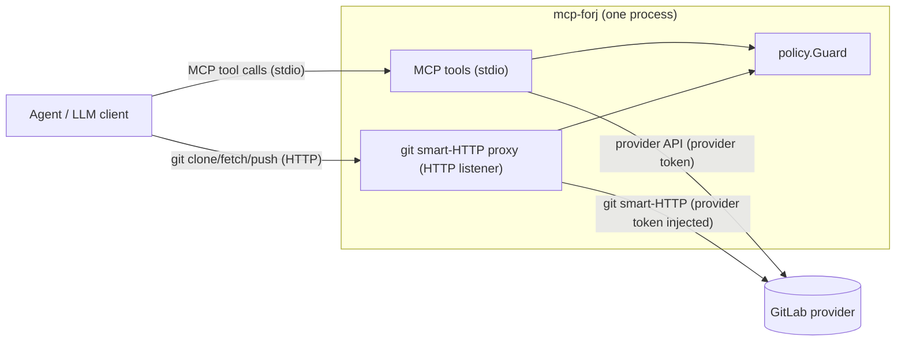
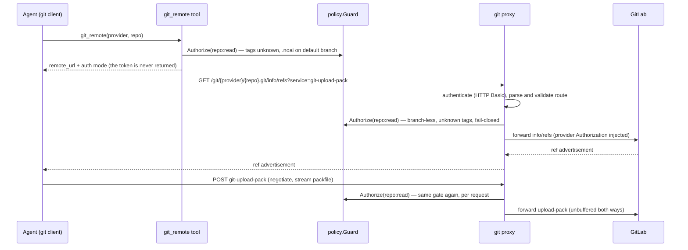

# Architecture

`mcp-forj` is **one product with two entry points**, both in the same process and sharing one
authorization core. Neither entry point re-implements policy.

1. **MCP tools over stdio** — structured access for an agent: list/view merge requests, comment,
   rebase, merge, read files and (while the proxy runs) the `git_remote` discovery tool.
2. **Git smart-HTTP reverse proxy over HTTP** (optional, `server.git_proxy`) — real
   `git clone`/`fetch`/`push` against the same policy.

## One policy core

Both entry points call **the same `policy.Guard`** with the tuple
`(provider, repository, capability, tags, path/ref/branch)`: deny by default, ordered
first-match-wins rules, tag/path/branch filters, and the `.noai` default-deny overlay (skipped only
by a grant with `noai: allow`). Entry-point-specific checks are **additive on top of** that same
decision:

- **MCP tools**: argument and path validation, size caps, tool-specific provider calls.
- **Git proxy**: route/segment validation, HTTP Basic, pkt-line parsing, per-branch
  `repo:write` authorization, push guardrails.

Where the git protocol cannot express a check the tools perform, the proxy **fails closed** instead
of relaxing the rule (see "Why fail-closed where git cannot check"). The proxy is therefore never
more lenient than the tools for the same configuration.

## Components



The `git_remote` tool is the bridge between the two doors: it authorizes `repo:read` through the
guard and returns the credential-free proxy URL. The proxy token is never part of any tool output.

## Clone / fetch flow



Every request re-runs the pipeline `authenticate → parseRoute → registry → Guard.Authorize` before
anything touches the provider. With a configured `git_proxy.token` clients use HTTP Basic (username
ignored); without it the proxy is loopback-only and performs no client authentication.

## Push flow

```mermaid
sequenceDiagram
  participant A as Agent (git client)
  participant G as policy.Guard
  participant X as git proxy
  participant U as GitLab
  A->>X: GET info/refs?service=git-receive-pack (discovery)
  X->>X: authenticate (HTTP Basic), parse route
  X->>G: Authorize(repo:write) — branch-less: no branches filter applies here
  X->>U: forward discovery (provider token injected)
  U-->>X: ref advertisement
  X-->>A: ref advertisement
  A->>X: POST git-receive-pack (pkt-line commands, push options, packfile)
  X->>X: parse command section + push-options section (bounded, no provider call)
  loop each unique target branch
    X->>G: AuthorizeBranch(repo:write, branch)
    Note over G: branches filter of the grant (without one: deny); .noai on default AND target branch
  end
  X->>U: DefaultBranch, ResolveRef, MergeBase (guardrail state)
  Note over X: only refs/heads/, never default branch, no deletes, fast-forward incl. stale base
  opt push options present
    X->>G: Authorize(mr:write) for merge_request.*, Authorize(mr:merge) for auto-merge
    Note over X: target_project, ci.* and unknown options: deny (fail-closed)
  end
  X->>U: forward receive-pack (original bytes, provider token injected)
```

Order matters: **policy first, provider metadata second.** The pkt-line command section is parsed
before authorization (bounded, no provider call); every unique, syntactically valid target branch
is then authorized against the `repo:write` **`branches` filter** — a grant without one denies every
push, and an invalid branch name never reaches the guard (no marker read at an unvalidated ref).
Only afterwards do the additive guardrails read provider state: no non-branch refs, never the
default branch (hard-coded), no deletes, advertised base must equal the current tip (stale base =
force push in disguise) and `MergeBase(tip, new) == tip`. Finally every **push option** is checked
(`merge_request.*` → `mr:write`, auto-merge → also `mr:merge`, anything else → deny), because an
option makes the provider perform actions no ref update covers. The body — commands, options and
packfile — is replayed unchanged via `io.MultiReader`, so the upstream sees the exact bytes the
client sent.

## Why fail-closed where git cannot check

- **Paths.** A fetch is whole-tree and the proxy does not parse packfiles, so `paths.include` /
  `paths.exclude` cannot be enforced over git. Git requests reach the guard with an **empty path**
  and an active path filter with an empty path fails closed: an active `paths` filter means
  **no git access** for that capability (fetch, clone and push alike).
- **Tags.** Git requests carry no labels/topics and the proxy keeps no metadata cache, so tags are
  unknown and any tag-constrained grant denies over git — deliberately stricter than the tools,
  which fetch the tags first.
- **`.noai` on fetch.** The fetch protocol names no ref the proxy could read the marker at before
  serving the whole tree, so the default branch is the fail-closed choice. A **push** does name its
  branches, so `AuthorizeBranch` checks the marker on the default branch **and** the target branch.

Every repository/capability denial on git traffic answers the identical 403 ("repository is not
accessible"), keeping a `.noai` repository or branch indistinguishable from an unknown one
(invariant 6).

## Related documents

- `adr/0011-git-smart-http-reverse-proxy.md` — decisions, forwarding hardening, full MVP limits.
- `method-specs/git_remote.md` — contract of the clone-URL discovery tool.
- `method-specs/authorization.md` — the shared authorization pipeline.
- `../AGENTS.md` — invariants; `../README.md` — user-facing Git proxy section.
